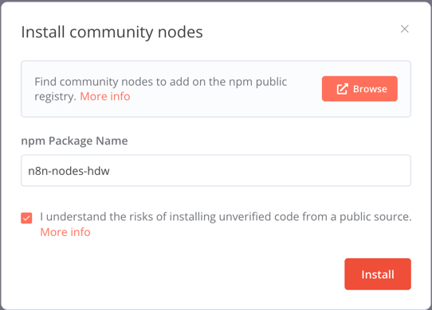
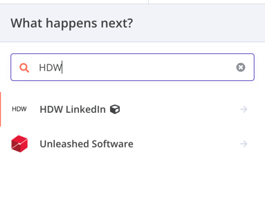
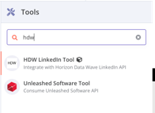

# n8n-nodes-anysite

This is an n8n community node. It lets you use AnySite services for LinkedIn, Twitter (X), Reddit, Instagram, and website parsing in your n8n workflows.

AnySite provides advanced social network data extraction capabilities, allowing you to search for users, view profiles, analyze posts, gather company information, and manage social media accounts across multiple platforms.

[n8n](https://n8n.io/) is a [fair-code licensed](https://docs.n8n.io/reference/license/) workflow automation platform.

[Installation](#installation)  
[Operations](#operations)  
[Credentials](#credentials)  
[Compatibility](#compatibility)  
[Resources](#resources)  

## Installation

Follow the [installation guide](https://docs.n8n.io/integrations/community-nodes/installation/) in the n8n community nodes documentation.
[NPM Package](https://www.npmjs.com/package/n8n-nodes-anysite)
1. Go to the Settings -> Community nodes -> Press Install
2. Install npm package: **n8n-nodes-anysite**

3. Reboot your n8n app
4. Find in n8n palette AnySite nodes

	

	and AnySite Agent tools

	
5. !!!REBOOT YOUR N8N APP!!!
6. Profit

**For local installation:**

```bash
npm install n8n-nodes-anysite
```

## Operations

This node package includes six separate nodes, each with its own set of capabilities:

### AnySite LinkedIn Node

The main LinkedIn data extraction node supporting the following resources and operations:

#### User Resource
* **Search**: Search for LinkedIn users with various filters including keywords, name, title, company, location
* **Get Profile**: Get detailed LinkedIn user profile information
* **Get Posts**: Retrieve posts from a specific LinkedIn user
* **Get Reactions**: Get reactions from a specific LinkedIn user

#### Email Resource
* **Get User by Email**: Find LinkedIn user profiles associated with an email address

#### Post Resource
* **Get Post Comments**: Retrieve comments on a LinkedIn post
* **Get Post Reposts**: Get reposts of a LinkedIn post

#### Company Resource
* **Get Company**: Retrieve detailed information about a LinkedIn company
* **Get Company Employees**: Search for employees of a specific LinkedIn company
* **Get Company Posts**: Retrieve posts from a LinkedIn company page

#### Group Resource
* **Get Group**: Get LinkedIn group information

#### Search Resource
* **Sales Navigator Search**: Perform advanced user searches using LinkedIn Sales Navigator filters
* **Search Jobs**: Search for LinkedIn job postings with filters for experience level, job type, work type, etc.
* **Search Companies**: Find LinkedIn companies with filters for location, industry, employee count
* **Search Industries**: Find LinkedIn industries by name
* **Search Locations**: Find LinkedIn locations by name

#### Google Resource
* **Search Companies**: Find LinkedIn companies using Google search
* **Google Search**: Perform a general Google search

### AnySite LinkedIn Management Node

Enables actions on LinkedIn using authenticated accounts:

#### User Resource
* **Send Connection**: Send a connection invitation to a LinkedIn user
* **Get Connections**: Retrieve your LinkedIn connections
* **Get Profile (Me)**: Get information about your own LinkedIn account

#### Chat Resource
* **Send Message**: Send a chat message to a LinkedIn user
* **Get Messages**: Get chat messages with a LinkedIn user
* **Get Conversations**: Get all LinkedIn conversations

#### Post Resource
* **Create Post**: Create a new LinkedIn post
* **Create Comment**: Create a comment on a LinkedIn post or another comment

### AnySite Twitter Node

Provides access to Twitter (X) data:

#### User Resource
* **Get Profile**: Get Twitter user profile information
* **Get Posts**: Retrieve tweets from a specific Twitter user

#### Search Resource
* **Search Users**: Search for Twitter users
* **Search Posts**: Search for tweets with comprehensive filtering options including:
  * Exact phrase matching
  * Inclusion/exclusion of specific words
  * Hashtag filtering
  * Language filtering
  * Account filtering (from, to, mentioned)
  * Engagement metrics (minimum replies, likes, retweets)
  * Date range specification
  * Search type (Top or Latest)

### AnySite Reddit Node

Provides access to Reddit data:

#### Search Resource
* **Search Posts**: Search for Reddit posts with comprehensive filtering options including:
  * Query-based search across all of Reddit
  * Sort options (relevance, hot, new, top, rising, comments)
  * Time filters (hour, day, week, month, year, all time)
  * Subreddit-specific search

### AnySite Instagram Node

Provides access to Instagram data:

#### User Resource
* **Get Profile**: Get Instagram user profile information including follower count, following count, bio, verification status
* **Get Posts**: Retrieve posts from a specific Instagram user with media details
* **Get Friendships**: Get followers or following list of an Instagram user
* **Get Reels**: Retrieve reels from a specific Instagram user

#### Post Resource
* **Get Post**: Get detailed Instagram post information including metadata, media, and statistics
* **Get Comments**: Retrieve comments on an Instagram post
* **Get Likes**: Retrieve likes on an Instagram post

#### Search Resource
* **Search Posts**: Search for Instagram posts by query with configurable result count

### AnySite Web Parser Node (beta)

Provides powerful website scraping and crawling functionality via the AnySite API:

* **Scrape**: Scrape a single webpage and return one or more of the following formats – Markdown, HTML, raw HTML, links, screenshot, or full-page screenshot. Options are available to extract only the main content, switch to a mobile viewport, skip TLS verification, remove base64 images, and set a load timeout.
* **Map**: Discover and list URLs starting from a given page. You can control whether sitemaps are used, include sub-domains, specify a search term filter, and set a maximum number of URLs to return.
* **Crawl**: Launch a crawl that traverses multiple pages beginning at a start URL with a configurable overall timeout.

## Credentials

To use this node, you need an API key from AnySite:

1. Register for an account at [anysite.io](https://app.anysite.io/)
2. Navigate to your account settings to generate an API key
3. For operations that require account management (like chat, connections, etc.), you'll also need to provide your Account ID

When setting up the node in n8n, add your credentials using the "AnySite API" credential type.

## Compatibility

- Requires Node.js 18.10 or later
- Compatible with n8n versions that support the N8N Nodes API Version 1

## Resources

* [n8n community nodes documentation](https://docs.n8n.io/integrations/community-nodes/)
* [AnySite API Documentation](https://api.anysite.io/redoc)
* [AnySite Website](https://anysite.io)
